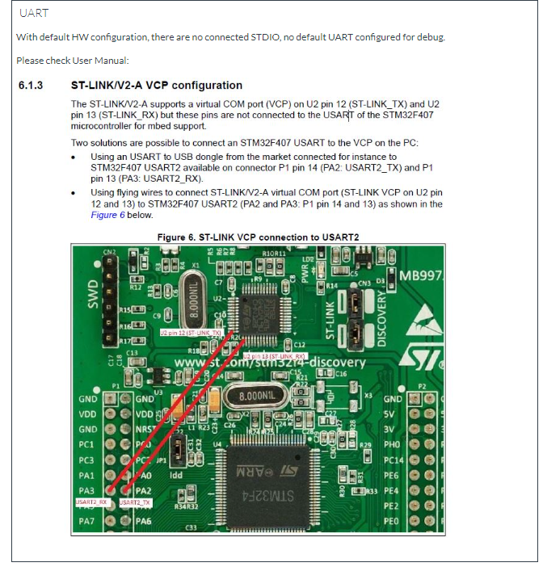
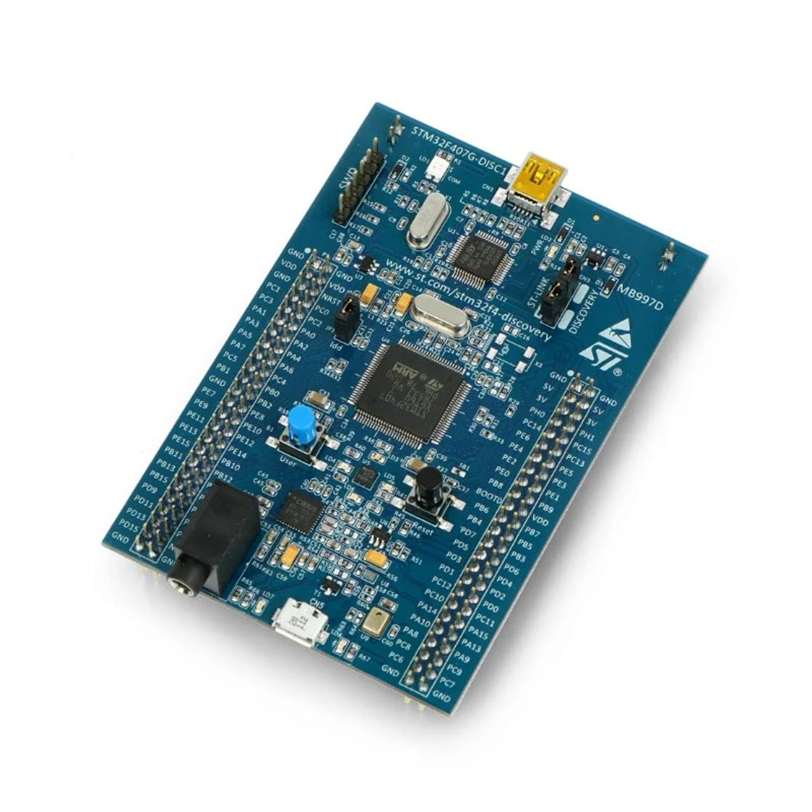
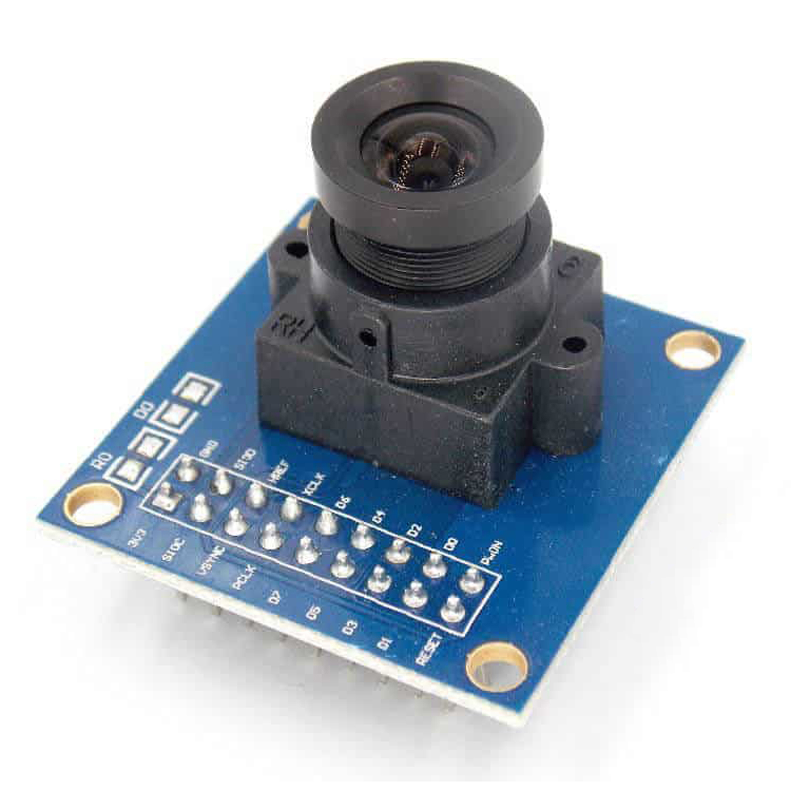

# Digital_Camera using Embedded C, STM32 Board  
In this project, a first version of a digital camera was design and developed.  

Components used in this project are: 
1. STM32F4 Discovery Board  
2. OV7670 Image sensor Module  
3. 3.2inch ili9431 16Bits Display  

1. Final Project Setup
2. Results

# Important Technical Detials  
For this project to work with the STM32F407 discovery board, a configuration was made on the board by performing tight soldering using flying wires to connect ST-LINK/V2-A virtual COM port (ST-LINK VCP on U2 pin 12 and 13) to STM32F407 USART2 (PA2 and PA3: P1 pin 14 and 13) as shown below
 

# Images of the components used: 
1.STM32F4 Discovery Board  
 
2. OV7670 Image sensor Module  
 
3. 3.2inch ili9431 16Bits Display  
 

# Final Project Setup  

